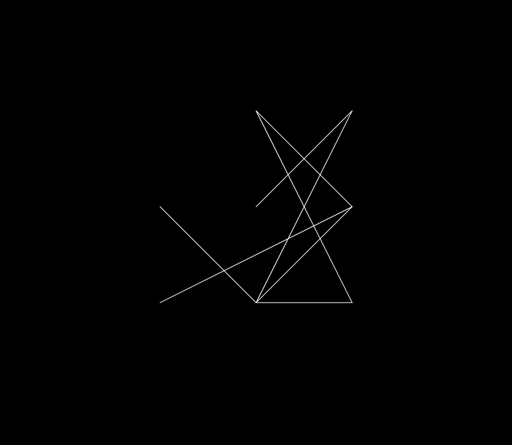
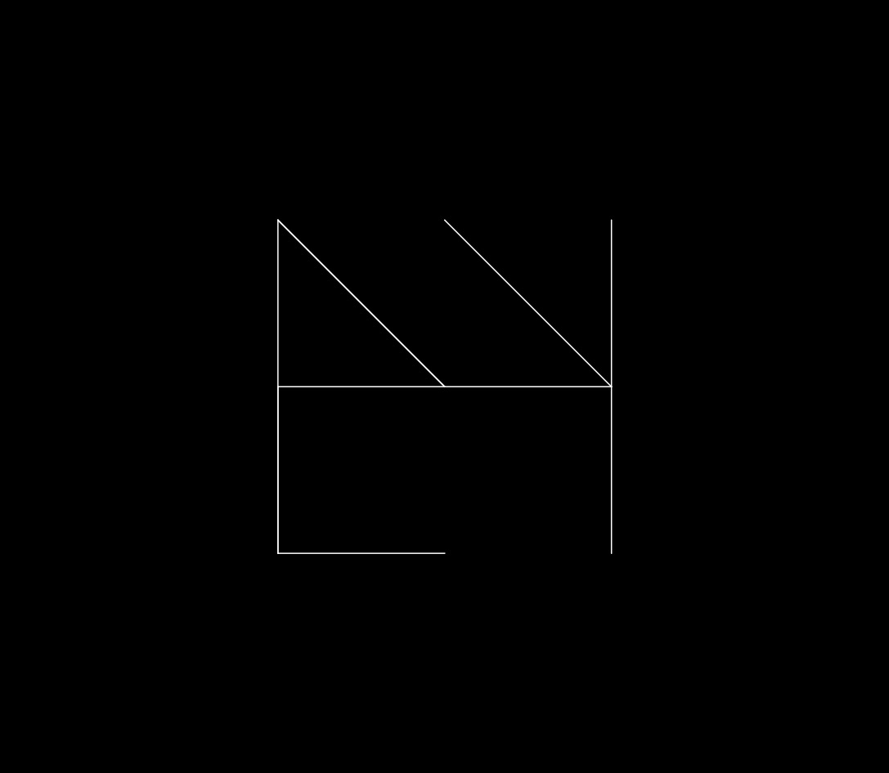

# algorithmic-lines
Algorithmically generated line art, with a nice UI built with [p5.js](https://p5js.org/).

This project uses randomness to create line drawings. Each drawing starts by creating a grid points. Next, the points may be randomly scaled randomly in either direction. Lastly, every single point in a drawing is connected a random to exactly one other point in the grid.

    
    
     
    (<i>a few examples</i>)
    

This project consists of a few different modes, where each mode uses the process above to create line art with different starting parameters. In *Grid* there are 10,078,751,602,022,313,874,633,200 possible line combinations that can be shown. In *One*, you'd have to stay on the website generating drawings for 79,898,779,189,040,400 (79 quadrillion) years before you would see the same drawing twice. The universe itself is only 13,800,000,000 (13.8 billion) years old. In *Chaos* and *Quad* each drawing is more rare by many orders of magnitude.

The website also includes a *save* option for users to download the unique line art that was generated on their visit.

Each drawing is most likely something that will only ever be seen once.

This project is currently being hosted at [henryburkhardt.github.io/algorithmic-lines](henryburkhardt.github.io/algorithmic-lines)
